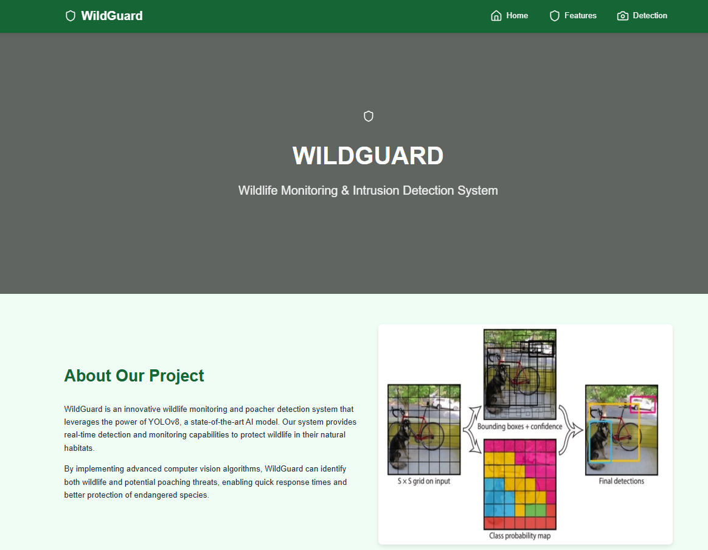
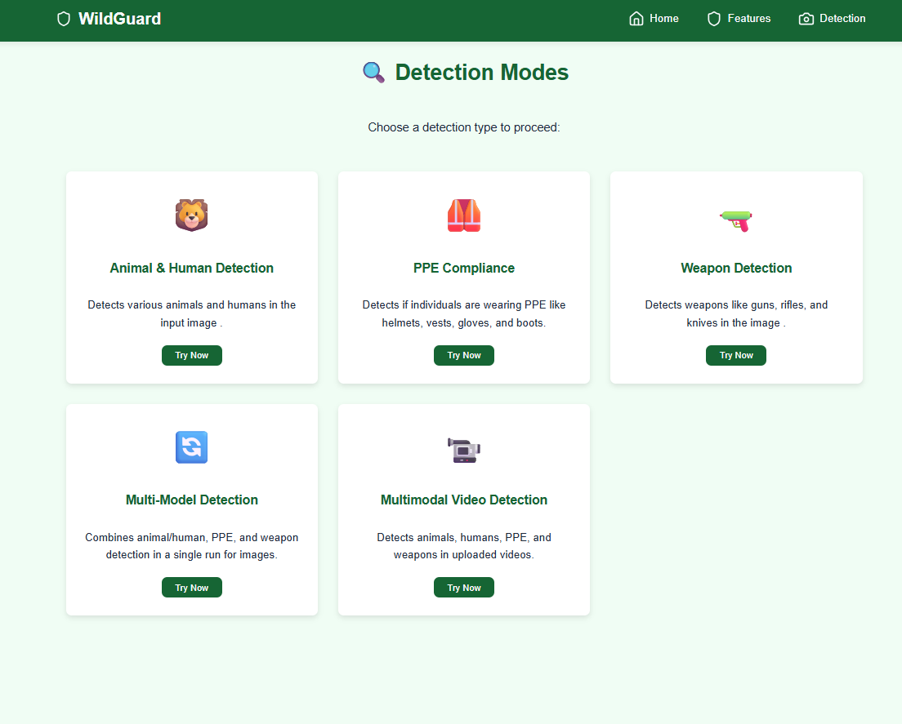
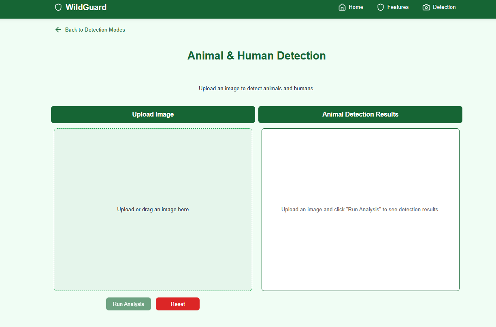
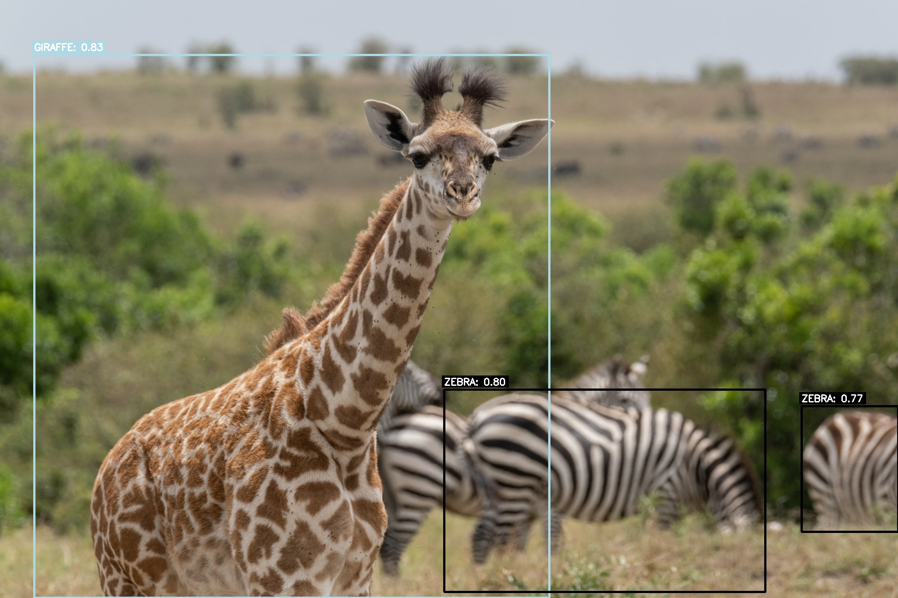
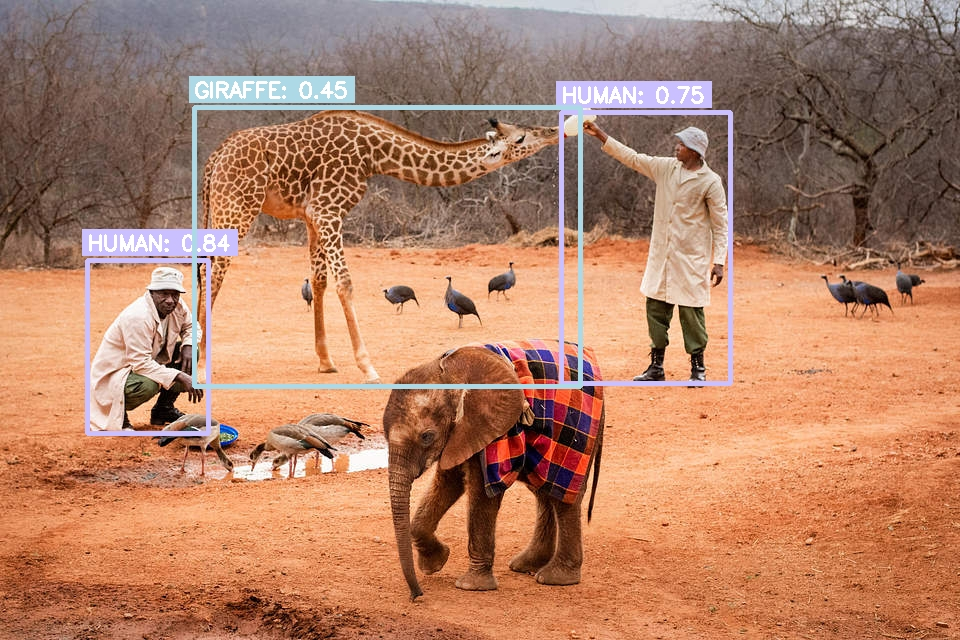
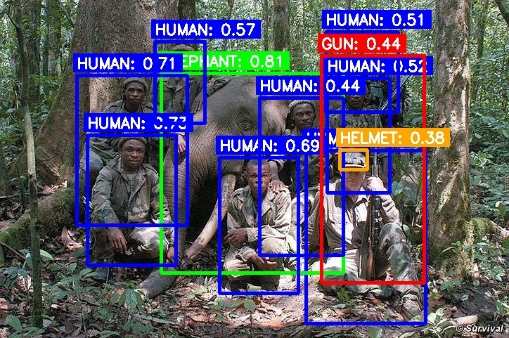

# WildGuard: AI-Powered Multi-Model Detection Dashboard

[](https://opensource.org/licenses/MIT)
[](https://github.com/esannihith/Wildlife-Monitoring-using-Yolov8/issues)
[](https://github.com/esannihith/Wildlife-Monitoring-using-Yolov8/actions)
[](https://www.python.org/downloads/)
[](https://flask.palletsprojects.com/)
[](https://github.com/psf/black)
[](https://app.roboflow.com/sannihith-wghgn/animal-detection-kq9h0/models)
[](https://app.roboflow.com/sannihith-wghgn/rifle-6srh6-r8swv/models)
[](#)


WildGuard is a Flask-based web application that provides a user-friendly dashboard for performing various AI-powered detections on images and videos. It integrates multiple detection models to identify animals, humans, Personal Protective Equipment (PPE), and weapons.

## Description

The primary purpose of WildGuard is to offer a centralized platform for leveraging different object detection models without requiring users to interact with complex code or APIs directly. Users can upload media files (images or videos) and select from various detection modes, including individual model inferences or combined multi-model analysis. The application is designed to be intuitive, providing visual feedback and summaries of detection results.

## Features

*   **Modular Detection Modes:**
    *   **Animal & Human Detection:** Identifies various animals (tiger, bear, elephant, giraffe, zebra, horse) and humans in images using the [Roboflow Animal Detection Model](https://app.roboflow.com/sannihith-wghgn/animal-detection-kq9h0/models).
    *   **PPE Compliance Detection:** Detects Personal Protective Equipment (e.g., helmets, vests, gloves, boots, and persons) in images using a local YOLOv8 (`.pt`) model.
    *   **Weapon Detection:** Identifies weapons (e.g., guns, rifles, knives) in images using the [Roboflow Weapon Detection Model](https://app.roboflow.com/sannihith-wghgn/rifle-6srh6-r8swv/models).
*   **Combined Inference:**
    *   **Multi-Model Image Detection:** Runs all three detection models (Animal/Human, PPE, Weapon) on a single image and presents a unified result.
    *   **Multi-Model Video Detection:** Processes uploaded videos frame by frame, applying all three detection models to each frame, and generates an output video with embedded detections.
*   **User-Friendly Interface:**
    *   Clear navigation and mode selection.
    *   Drag-and-drop file uploads for images and videos.
    *   Image and video previews (for uploaded content).
    *   Visual display of detection results with bounding boxes and labels.
    *   Modal view for enlarged images.
    *   Loading indicators during processing.
*   **Result Summaries:** Provides counts of detected objects for multi-model image analysis.
*   **Responsive Design:** The UI is designed to be usable across different screen sizes.
*   **Performance:** Achieves an average precision of 80% across models.

## Screenshots

<table>
  <tr>
    <td align="center">
      <br/>
      <sub><b>Home Page</b><br/>The WildGuard home page.</sub>
    </td>
    <td align="center">
      <br/>
      <sub><b>Detection Mode Selection</b><br/>Selecting a detection mode.</sub>
    </td>
  </tr>
  <tr>
    <td align="center">
      <br/>
      <sub><b>Image Upload</b><br/>Image upload interface.</sub>
    </td>
    <td align="center">
      <br/>
      <sub><b>Animal Detection</b><br/>Animal detection result with bounding boxes.</sub>
    </td>
  </tr>
  <tr>
    <td align="center">
      <br/>
      <sub><b>Weapon Detection</b><br/>Weapon detection result with bounding boxes.</sub>
    </td>
    <td align="center">
      <br/>
      <sub><b>Multimodal Detection</b><br/>Multimodal detection result with bounding boxes.</sub>
    </td>
  </tr>
</table>


## Installation

Follow these steps to set up and run the project locally:

1.  **Clone the Repository:**
    ```bash
    git clone https://github.com/esannihith/Wildlife-Monitoring-using-Yolov8.git
    cd your-repository
    ```

2.  **Create and Activate a Virtual Environment:**
    *   **Windows:**
        ```bash
        python -m venv benv
        .\benv\Scripts\activate
        ```
    *   **macOS/Linux:**
        ```bash
        python3 -m venv benv
        source benv/bin/activate
        ```

3.  **Install Dependencies:**
    ```bash
    pip install -r requirements.txt
    ```

4.  **Set Up Environment Variables:**
    Create a `.env` file in the project root directory. This file will store your API keys and other configurations.
    ```env
    # For Animal Detection (Roboflow)
    # Dataset: https://app.roboflow.com/sannihith-wghgn/animal-detection-kq9h0/models
    API_KEY=\"YOUR_ROBOFLOW_API_KEY\" # Replace with your Roboflow API Key
    MODEL_ID=\"YOUR_ANIMAL_MODEL_ID\"  # e.g., animal-detection-kq9h0
    MODEL_VERSION=\"YOUR_ANIMAL_MODEL_VERSION\" # e.g., 4

    # For Weapon Detection (Roboflow)
    # Dataset: https://app.roboflow.com/sannihith-wghgn/rifle-6srh6-r8swv/models
    WEAPON_API_KEY=\"YOUR_ROBOFLOW_API_KEY\" # Replace with your Roboflow API Key (can be the same as above)
    WEAPON_MODEL_ID=\"YOUR_WEAPON_MODEL_ID\" # e.g., rifle-6srh6-r8swv
    WEAPON_MODEL_VERSION=\"YOUR_WEAPON_MODEL_VERSION\" # e.g., 1

    # General Roboflow API URL (if different from default)
    ROBOFLOW_API_URL=\"https://detect.roboflow.com\"
    
    # Flask specific
    FLASK_ENV=\"development\"

    # Optional: Request Timeout
    REQUEST_TIMEOUT=\"120\" 
    ```
    *   Replace placeholders like `\\\"YOUR_ROBOFLOW_API_KEY\\\"`, `\\\"YOUR_ANIMAL_MODEL_ID\\\"`, etc., with your actual details from Roboflow.
    *   You can find your API key and model-specific IDs/versions on your Roboflow dashboard under the respective projects.

5.  **Ensure PPE Model Availability:**
    The PPE detection model (`ppe.pt`) is expected to be in the `models/` directory at the project root. If it\'s located elsewhere, the application will attempt to find it in common locations, but placing it in `models/ppe.pt` is recommended.

6.  **Run the Flask Application:**
    ```bash
    python app.py
    ```
    The application will typically be available at `http://127.0.0.1:5000`.

## Usage

1.  **Open the Application:** Navigate to the application URL in your web browser (e.g., `http://127.0.0.1:5000`).
2.  **Navigate to Detection:** Click on the "Detection" link in the navigation bar.
3.  **Select a Detection Mode:**
    *   Choose from "Animal & Human Detection", "PPE Compliance", "Weapon Detection", "Multi-Model Image Detection", or "Multimodal Video Detection".
4.  **Upload Media:**
    *   **For Image Modes:** Drag and drop an image file onto the designated area or click to browse and select an image file.
    *   **For Video Mode:** Drag and drop a video file or click to select a video file.
5.  **Run Analysis:** Click the "Run Analysis" button.
6.  **View Results:**
    *   **Images:** The processed image with bounding boxes and labels will be displayed. A summary of detected objects may also be shown. You can click on the input or output image to view it in a larger modal.
    *   **Videos:** A processed video with detections embedded in each frame will be available for viewing/download.

## Configuration

### Environment Variables

The project uses a `.env` file to manage API keys and model configurations. Refer to the \\\"Set Up Environment Variables\\\" section under [Installation](#installation) for details on the required variables:

*   `API_KEY`: Your Roboflow API key for the animal detection model. Get this from your Roboflow account.
*   `MODEL_ID`: The model ID for your Roboflow animal detection project (e.g., `animal-detection-kq9h0`). Found on the model page at [Roboflow Animal Detection](https://app.roboflow.com/sannihith-wghgn/animal-detection-kq9h0/models).
*   `MODEL_VERSION`: The version number of your Roboflow animal detection model (e.g., `4`). Found on the model page.
*   `WEAPON_API_KEY`: Your Roboflow API key for the weapon detection model (can be the same as for the animal model).
*   `WEAPON_MODEL_ID`: The model ID for your Roboflow weapon detection project (e.g., `rifle-6srh6-r8swv`). Found on the model page at [Roboflow Weapon Detection](https://app.roboflow.com/sannihith-wghgn/rifle-6srh6-r8swv/models).
*   `WEAPON_MODEL_VERSION`: The version number of your Roboflow weapon detection model (e.g., `1`). Found on the model page.
*   `ROBOFLOW_API_URL` (Optional): The base URL for the Roboflow API. Defaults to `https://detect.roboflow.com`.
*   `FLASK_ENV`: Sets the Flask environment (e.g., `development`, `production`).
*   `REQUEST_TIMEOUT` (Optional): Sets the timeout for requests to external APIs (e.g., Roboflow) in seconds.

### PPE Model

*   The PPE detection model (`ppe.pt`) is loaded locally. Ensure this file is present, ideally in the `models/` directory. The application searches the following paths:
    *   `models/ppe.pt`
    *   `ppe.pt` (project root)
    *   `weights/ppe.pt`
    *   `static/models/ppe.pt`

### Application Configuration (in `app.py`)

*   `UPLOAD_FOLDER`: `static/uploads` - Directory where uploaded files are temporarily stored.
*   `RESULT_FOLDER`: `static/results` - Directory where processed images and videos are saved.

These paths are created automatically if they don\'t exist.

## Technologies Used

*   **Backend:**
    *   Python 3.9+
    *   Flask: Micro web framework for building the web application.
    *   OpenCV (cv2): For image and video processing tasks (reading, writing, drawing).
    *   Roboflow Inference SDK: For interacting with Roboflow models (Animal & Weapon detection).
    *   Ultralytics YOLOv8 (via `torch` and `torchvision`): For local PPE detection.
    *   Pillow: For image manipulation (implicitly used by other libraries).
    *   python-dotenv: For managing environment variables.
    *   Requests: For making HTTP requests (used by Roboflow SDK).
*   **Frontend:**
    *   HTML5
    *   CSS3
    *   JavaScript (Vanilla)
    *   Lucide Icons: For UI icons.
*   **Development & Tools:**
    *   Git & GitHub: Version control and repository hosting.
    *   Virtual Environments (e.g., `venv`, `benv`): For managing project dependencies.

## Contributing

Contributions are welcome! If you\'d like to contribute to WildGuard, please follow these steps:

1.  **Fork the repository** on GitHub.
2.  **Clone your forked repository** to your local machine.
3.  **Create a new branch** for your feature or bug fix:
    ```bash
    git checkout -b feature/your-feature-name
    ```
    or
    ```bash
    git checkout -b fix/your-bug-fix-name
    ```
4.  **Make your changes** and commit them with clear, descriptive messages.
5.  **Push your changes** to your forked repository:
    ```bash
    git push origin feature/your-feature-name
    ```
6.  **Open a Pull Request (PR)** from your forked repository to the main WildGuard repository.
    *   Provide a clear title and description for your PR, explaining the changes and why they are needed.
    *   Reference any relevant issues.

Please ensure your code adheres to the project\'s coding style and that any new dependencies are added to `requirements.txt`.

## License

This project is licensed under the **MIT License**. See the [LICENSE](LICENSE.md) file for details.

[](https://opensource.org/licenses/MIT)

## Contact / Support

For issues, questions, or support, please open an issue on the [GitHub Issues page](https://github.com/esannihith/Wildlife-Monitoring-using-Yolov8/issues).

## Acknowledgements

*   **Roboflow:** For providing the platform and hosting for the animal and weapon detection models.
*   **Ultralytics YOLOv8:** For the powerful object detection model used for PPE detection.
*   **Flask:** For the web framework.
*   **Lucide Icons:** For the clean and modern icons used in the UI.
*   Inspiration from various AI and computer vision projects.

---


